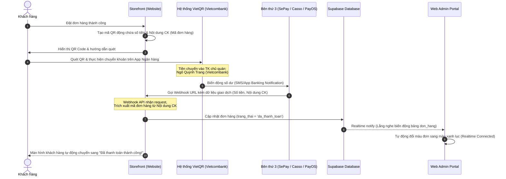

# Hướng Dẫn Tích Hợp & Vận Hành Thanh Toán Tự Động VietQR qua Webhook

Tài liệu này hướng dẫn chi tiết cách thức hoạt động và quy trình cấu hình tính năng **Thanh toán tự động qua VietQR** để hệ thống tự động nhận diện giao dịch và chuyển trạng thái đơn hàng thành `Đã thanh toán` chỉ sau 2-5 giây mà không cần chủ quán xác nhận thủ công.

---

## 1. Sơ đồ Luồng Hoạt động (Workflow)



---

## 2. Các thành phần cần thiết để Tích hợp

Để hệ thống hoạt động tự động, chúng ta cần liên kết tài khoản ngân hàng của chủ quán với một dịch vụ trung gian chuyên quét biến động số dư (Ví dụ: **SePay.vn**, **Casso.vn** hoặc **PayOS.vn**). Các bước cấu hình như sau:

### Bước 2.1: Chuẩn bị Tài khoản Ngân hàng nhận tiền
*   Ngân hàng: **VietinBank** (hoặc các ngân hàng lớn hỗ trợ quét nhanh như Techcombank, MBBank, ACB).
*   Số tài khoản: `101882692631`
*   Tên chủ tài khoản: **Ngo Quynh Trang**

### Bước 2.2: Đăng ký dịch vụ quét biến động số dư (Khuyên dùng SePay hoặc Casso)
1.  Đăng ký tài khoản trên [SePay.vn](https://sepay.vn) (hoặc Casso.vn).
2.  Kết nối tài khoản ngân hàng của bạn vào SePay (bằng cách chia sẻ thông báo biến động số dư qua ứng dụng ngân hàng hoặc phân quyền xem lịch sử giao dịch).
3.  **Tạo API Webhook:**
    *   Trong cấu hình SePay, tạo một Webhook mới.
    *   Điền **Webhook URL** hướng tới API của dự án:
        `https://website-vpc.vercel.app/api/payment-webhook` (hoặc domain chính thức của quán).
    *   Chọn sự kiện kích hoạt: **Khi có giao dịch tiền vào (Credit)**.

---

## 3. Cấu hình Mã QR trên Storefront (`index.html`)

Mã QR động được tạo tự động khi khách hàng bấm đặt hàng bằng cách sử dụng API của VietQR (VietQR.io hoặc QuickQr.io).

### Cách sinh mã QR động:
Khi khách hàng đặt đơn thành công, hệ thống sẽ gọi API sinh ảnh QR chứa đầy đủ thông tin:
```javascript
const bankId = "vietinbank"; // Mã ngân hàng thụ hưởng
const accountNo = "101882692631"; // STK thụ hưởng
const accountName = "Ngo Quynh Trang"; // Tên chủ tài khoản
const amount = order.tong_tien; // Số tiền đơn hàng
const orderCode = order.ma_don_hang; // Mã đơn hàng (Nội dung chuyển khoản)

// URL VietQR tiêu chuẩn
const qrUrl = `https://img.vietqr.io/image/${bankId}-${accountNo}-compact2.png?amount=${amount}&addInfo=${encodeURIComponent(orderCode)}&accountName=${encodeURIComponent(accountName)}`;

// Hiển thị ảnh QR này lên màn hình để khách hàng quét
document.getElementById('vietqr-image').src = qrUrl;
```

---

## 4. Xây dựng API Webhook xử lý tiền vào (`src/app/api/payment-webhook/route.ts`)

API này sẽ đón dữ liệu từ SePay gửi sang khi có tiền vào tài khoản ngân hàng, phân tích nội dung để đối soát và cập nhật cơ sở dữ liệu Supabase.

### Code mẫu API Route xử lý Webhook (Node.js/Next.js):
```typescript
import { NextResponse } from 'next/server';
import { createClient } from '@supabase/supabase-js';

// Khởi tạo Supabase Client với Service Role Key để bypass RLS
const supabaseUrl = process.env.NEXT_PUBLIC_SUPABASE_URL!;
const supabaseServiceKey = process.env.SUPABASE_SERVICE_ROLE_KEY!;
const supabase = createClient(supabaseUrl, supabaseServiceKey);

export async function POST(request: Request) {
  try {
    const body = await request.json();
    
    // 1. Trích xuất thông tin giao dịch từ SePay gửi qua
    // Cấu trúc SePay: body.transferAmount (số tiền), body.code (nội dung chuyển khoản)
    const amountReceived = parseFloat(body.transferAmount || body.amount || '0');
    const transferContent = String(body.code || body.content || "").toUpperCase();

    console.log(`📥 Nhận webhook giao dịch: ${amountReceived}đ, nội dung: "${transferContent}"`);

    // 2. Tìm mã đơn hàng bằng Regex
    // Định dạng đơn hàng: VPC-DH-YYYYMMDD-HHMMSS
    const orderCodeRegex = /VPC-DH-\d{8}-\d{6}/i;
    const match = transferContent.match(orderCodeRegex);

    if (!match) {
      return NextResponse.json({ success: false, message: "Không tìm thấy mã đơn hàng hợp lệ trong nội dung chuyển khoản" }, { status: 400 });
    }

    const orderCode = match[0];

    // 3. Đối soát đơn hàng trong Database
    const { data: order, error: fetchError } = await supabase
      .from('don_hang')
      .select('*')
      .eq('ma_don_hang', orderCode)
      .single();

    if (fetchError || !order) {
      return NextResponse.json({ success: false, message: `Không tìm thấy đơn hàng ${orderCode} trên hệ thống` }, { status: 404 });
    }

    // 4. Kiểm tra số tiền khớp
    const expectedAmount = parseFloat(order.tong_tien);
    if (amountReceived < expectedAmount) {
      // Trường hợp khách chuyển thiếu tiền
      await supabase
        .from('don_hang')
        .update({ 
          trang_thai: 'cho_xac_nhan_chuyen_khoan',
          ghi_chu: `[Hệ thống tự động] Khách chuyển thiếu tiền: Nhận ${amountReceived}đ, Cần ${expectedAmount}đ.`
        })
        .eq('id', order.id);

      return NextResponse.json({ success: false, message: "Khách chuyển thiếu tiền, chuyển sang trạng thái chờ xác nhận thủ công" });
    }

    // 5. Cập nhật trạng thái Đơn hàng thành ĐÃ THANH TOÁN
    const { error: updateError } = await supabase
      .from('don_hang')
      .update({ 
        trang_thai: 'da_thanh_toan',
        ghi_chu: `[Hệ thống tự động] Thanh toán thành công VietQR qua Webhook lúc ${new Date().toLocaleString('vi-VN')}.`
      })
      .eq('id', order.id);

    if (updateError) throw updateError;

    console.log(`✅ Đơn hàng ${orderCode} đã tự động đổi trạng thái sang Đã thanh toán!`);
    return NextResponse.json({ success: true, message: `Thanh toán tự động thành công đơn hàng ${orderCode}` });

  } catch (error: any) {
    console.error("❌ Lỗi xử lý Webhook thanh toán:", error);
    return NextResponse.json({ success: false, error: error.message }, { status: 500 });
  }
}
```

---

## 5. Quy trình Kiểm tra & Vận hành
1.  **Test Giao dịch Nhỏ:** Hãy thực hiện đặt một đơn hàng trị giá 2.000đ hoặc 10.000đ trên web.
2.  **Quét QR & Chuyển khoản:** Sử dụng app ngân hàng quét mã QR hiển thị trên web và thực hiện chuyển khoản.
3.  **Quan sát Realtime:** 
    *   Trình duyệt của khách hàng sẽ tự động chuyển sang trang chúc mừng nhờ hàm lắng nghe realtime từ Supabase.
    *   Màn hình Web Admin của chủ quán cũng sẽ tự động đổi màu trạng thái đơn hàng sang màu xanh lục mà không cần F5 tải lại trang.
